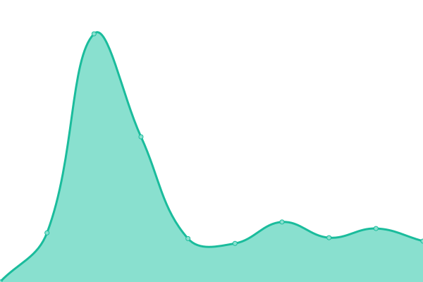
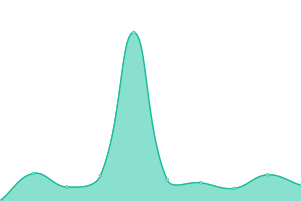
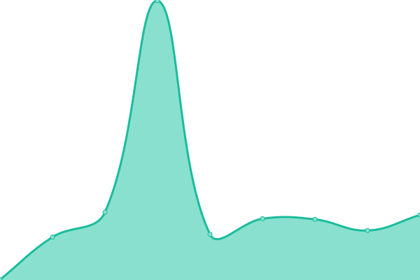
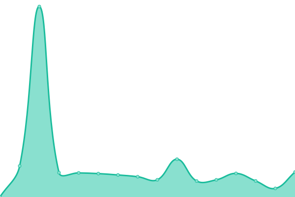

# [📈 Live Status](https://status.linkpuff.me): <!--live status--> **🟥 Complete outage**

This repository contains the open-source uptime monitor and status page for [dimaguy](https://status.linkpuff.me), powered by [Upptime](https://github.com/upptime/upptime).

With [Upptime](https://upptime.js.org), you can get your own unlimited and free uptime monitor and status page, powered entirely by a GitHub repository. We use [Issues](https://github.com/dimaguy/gh-status-page/issues) as incident reports, [Actions](https://github.com/dimaguy/gh-status-page/actions) as uptime monitors, and [Pages](https://status.linkpuff.me) for the status page.

<!--start: status pages-->
<!-- This summary is generated by Upptime (https://github.com/upptime/upptime) -->
<!-- Do not edit this manually, your changes will be overwritten -->
<!-- prettier-ignore -->
| URL | Status | History | Response Time | Uptime |
| --- | ------ | ------- | ------------- | ------ |
|  [linkpuff.me](https://linkpuff.me/teapot/) | 🟥 Down | [linkpuff-me.yml](https://github.com/dimaguy/gh-status-page/commits/HEAD/history/linkpuff-me.yml) | 

 4484ms
     
 | 

<a href="https://status.linkpuff.me/history/linkpuff-me">99.80%</a>
    

|  [Luanet Webmin](https://luanet.ddns.net:10000/) | 🟥 Down | [luanet-webmin.yml](https://github.com/dimaguy/gh-status-page/commits/HEAD/history/luanet-webmin.yml) | 

 2363ms
     
 | 

<a href="https://status.linkpuff.me/history/luanet-webmin">99.78%</a>
    

|  [Home Assistant](https://home.linkpuff.me/) | 🟥 Down | [home-assistant.yml](https://github.com/dimaguy/gh-status-page/commits/HEAD/history/home-assistant.yml) | 

 2126ms
     
 | 

<a href="https://status.linkpuff.me/history/home-assistant">99.64%</a>
    

|  [Luanet Portainer](https://linkpuff.me/portainer/) | 🟥 Down | [luanet-portainer.yml](https://github.com/dimaguy/gh-status-page/commits/HEAD/history/luanet-portainer.yml) | 

 254ms
     
 | 

<a href="https://status.linkpuff.me/history/luanet-portainer">99.65%</a>
    

|  [Luanet Gitea](https://git.linkpuff.me/) | 🟥 Down | [luanet-gitea.yml](https://github.com/dimaguy/gh-status-page/commits/HEAD/history/luanet-gitea.yml) | 

 698ms
     
 | 

<a href="https://status.linkpuff.me/history/luanet-gitea">99.67%</a>
    

<!--end: status pages-->

[**Visit our status website →**](https://status.linkpuff.me)

## 📄 License

- Powered by: [Upptime](https://github.com/upptime/upptime)
- Code: [MIT](./LICENSE) © [dimaguy](https://status.linkpuff.me)
- Data in the `./history` directory: [Open Database License](https://opendatacommons.org/licenses/odbl/1-0/)
